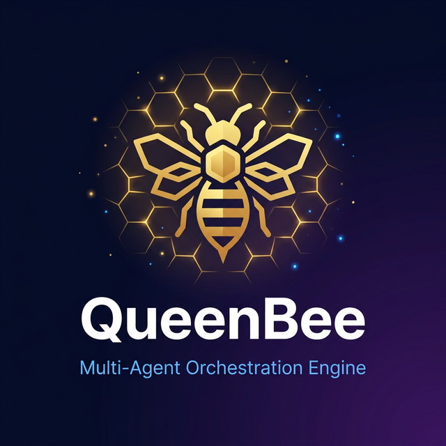
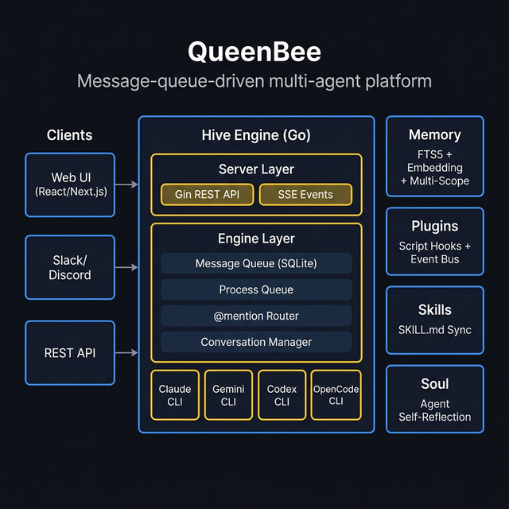

<div align="center">



# 🐝 QueenBee

### メッセージキュー駆動型マルチエージェントオーケストレーションエンジン

[](https://go.dev/)
[](LICENSE)
[](CONTRIBUTING.md)
[](https://github.com/heyangguang/queenbee/stargazers)

**[中文](README.md) | [English](README_EN.md) | 日本語**

**QueenBee は、オープンソースでローカルファーストのマルチ AI エージェント協調エンジンです。** SQLite メッセージキューを介して複数の AI CLI（Claude、Gemini、Codex、OpenCode）をオーケストレーションし、エージェント同士が `@mention` で会話・自動ルーティング・並列タスク実行を行います。永続メモリ、スキルシステム、ソウル自省機能を備えています。

[はじめに](#-はじめに) · [アーキテクチャ](#-アーキテクチャ) · [ドキュメント](#-ドキュメント) · [コントリビュート](#-コントリビュート)

</div>

---

## ✨ QueenBee の特徴

<table>
<tr>
<td width="50%">

### 🤖 従来の AI ツール
```
あなた → AI → コード → レビュー → 繰り返し
```
- シングルエージェント、シングルコンテキスト
- 手動調整
- セッション間のメモリなし
- チームコラボレーションなし

</td>
<td width="50%">

### 🐝 QueenBee
```
あなた → @agent メッセージ → キュー → エージェント → レスポンス
      → @チームメイト → ルーティング → 並列実行
```
- `@mention` ルーティングによるマルチエージェントチーム
- デッドレター + 自動リトライ付き SQLite キュー
- 永続メモリ（FTS5 + Embedding）
- プラグインフック + ソウル自省

</td>
</tr>
</table>

---

## 🏗 アーキテクチャ

QueenBee は**メッセージキュー駆動型**アーキテクチャを採用しており、すべてのエージェント間のやり取りは SQLite メッセージキューを通じてシリアル/パラレルにスケジューリングされます：

<div align="center">

</div>

```
                          ┌─────────────────────────┐
                          │      クライアント          │
                          │  Web UI / Slack / API    │
                          └───────────┬─────────────┘
                                      │ REST + SSE
                          ┌───────────▼─────────────┐
                          │    サーバー層 (Gin)        │
                          │  REST API  │  SSE Events │
                          ├─────────────────────────┤
                          │    エンジン層              │
                          │  ┌───────────────────┐  │
                          │  │  メッセージキュー    │  │   ┌──────────┐
                          │  │  (SQLite)          │  │   │  メモリ    │
                          │  │  pending → process │  │   │  FTS5 +   │
                          │  │  → complete / dead  │  │   │  Embedding│
                          │  └────────┬──────────┘  │   └──────────┘
                          │           │              │
                          │  ┌────────▼──────────┐  │   ┌──────────┐
                          │  │  プロセスキュー      │  │   │ プラグイン │
                          │  │  @mention ルーター  │  │   │  Hooks +  │
                          │  │  チームルーティング   │  │   │  EventBus │
                          │  │  会話マネージャー    │  │   └──────────┘
                          │  └────────┬──────────┘  │
                          │           │              │   ┌──────────┐
                          │  ┌────────▼──────────┐  │   │  スキル    │
                          │  │   InvokeAgent      │  │   │  SKILL.md │
                          │  │  ┌──────┬────────┐ │  │   │  同期     │
                          │  │  │Claude│ Gemini │ │  │   └──────────┘
                          │  │  │ CLI  │  CLI   │ │  │
                          │  │  ├──────┼────────┤ │  │   ┌──────────┐
                          │  │  │Codex │OpenCode│ │  │   │  ソウル    │
                          │  │  │ CLI  │  CLI   │ │  │   │  SOUL.md  │
                          │  │  └──────┴────────┘ │  │   │  自省     │
                          │  └───────────────────┘  │   └──────────┘
                          └─────────────────────────┘
```

### コア処理パイプライン

```
メッセージエンキュー → ClaimNextMessage（アトミック取得）
                   → ParseAgentRouting（@mention ルーティング）
                   → FindTeamForAgent（チーム検索）
                   → InvokeAgent（CLI 呼び出し + Fallback + クールダウン）
                   → ExtractTeammateMentions（[@teammate: msg] 抽出）
                   → EnqueueInternalMessage（チームメイトメッセージエンキュー）
                   → CompleteConversation（レスポンス集約 + 履歴保存）
```

---

## 🚀 主な機能

### 📬 SQLite メッセージキューエンジン
メッセージ駆動型のコアスケジューラー。メッセージは `pending → processing → completed / dead` のライフサイクルをたどります：
- **アトミック取得** — `ClaimNextMessage` で重複消費を防止
- **自動リトライ** — 5回失敗後にデッドレターキューに移動
- **クロスエージェント並列処理** — 異なるエージェントは完全並列、同一エージェントはシリアルロック
- **セッション復旧** — `RestoreConversations` で起動時にデータベースからアクティブセッションを復元
- **スタック復旧** — `RecoverStaleMessages` でタイムアウトメッセージを自動復旧

### 🏷 @mention ルーティングシステム
エージェント間は自然言語の `@mention` で協調：
```
ユーザー送信: @coder ログイン機能を実装して
ルーティング先: coder エージェント

coder の返信: [@reviewer: このコードをレビューしてください] [@tester: テストを書いてください]
システム自動: チームメイトメンションを抽出 → 対応エージェントにエンキュー
```
- **2段階マッチング** — まずエージェント ID で正確マッチ、次にチームリーダーにフォールバック
- **チームルーティング** — `@team-name` でチームリーダーに自動ルーティング
- **メッセージサニタイズ** — `@mention` プレフィックスを自動除去、クリーンなメッセージ本文を保持

### 🔌 4つの CLI プロバイダー + フォールバック
`os/exec` でローカル AI CLI を呼び出し、プロバイダー間の差異を統一抽象化：

| プロバイダー | CLI バイナリ | 特徴 |
|:------------|:------------|:-----|
| **Anthropic** | `claude` | stream-json 出力、`-c` 会話継続、`--dangerously-skip-permissions` |
| **Google** | `gemini` | `--yolo` モード、サンドボックス対応 |
| **OpenAI** | `codex` | `exec resume --last` 会話継続、JSON 出力 |
| **OpenCode** | `opencode` | `run` モード、JSON フォーマット |

- **自動フォールバック** — プライマリ失敗時に自動でバックアッププロバイダーに切替
- **クールダウン機構** — 連続失敗したプロバイダーを5分間クールダウン
- **アクティビティウォッチドッグ** — stdout タイムアウトでスタックを検知、自動プロセスキル
- **モデル解決** — `ResolveClaudeModel` / `ResolveGeminiModel` 等のスマートモデルマッピング

### 🧠 3階層縮退永続メモリ
多層メモリシステム。各エージェントが独立した長期メモリを保有：

```
検索優先度: Ollama Embedding ベクトル検索
              ↓（利用不可の場合）
           FTS5 全文検索
              ↓（利用不可の場合）
           LIKE あいまい検索
```

- **3つのスコープ** — エージェント専用 / チーム共有 / ユーザーグローバル
- **自動抽出** — 会話から価値あるメモリエントリを自動抽出
- **コンテキスト注入** — `FormatMemoriesForContext` で関連メモリをエージェントプロンプトに注入

### 🧩 スキルシステム
SKILL.md ファイルによる動的スキルマウントで、エージェントに専門能力を注入：
- **マルチ CLI 同期** — `.agents/skills/`、`.claude/skills/`、`.gemini/skills/` に同時書き込み
- **内蔵スキル発見** — `templates/` と `QUEENBEE_HOME` ディレクトリを自動スキャン
- **CLI グローバルスキルスキャン** — 各 CLI にインストール済みのグローバルスキルを発見
- **YAML Frontmatter** — 標準化メタデータ（name、description、allowed-tools）

### 👻 ソウル自省システム
エージェントがタスク完了後に自動で振り返り、永続的な `SOUL.md` アイデンティティファイルを更新：
- **増分更新** — 書き換えず、新しい経験と洞察のみ追加
- **非同期実行** — バックグラウンド goroutine で実行、メインフローをブロックしない
- **全プロバイダー対応** — 各 CLI に独立したソウル更新パスあり

### 📦 コンテキスト圧縮
長いメッセージを AI サマリーで自動圧縮し、トークン消費を削減：
- **スマート閾値** — 8000文字超で圧縮発動（設定可能）
- **AI サマリー** — コード、エラー、判断を保持し、冗長部分を削除
- **フォールバック切り詰め** — AI 圧縮失敗時に先頭・末尾各40%を保持

### 🔧 プラグインエンジン
複数のスクリプト言語をサポートする拡張可能なフックシステム：
- **双方向フック** — `TransformIncoming` / `TransformOutgoing` メッセージインターセプト
- **多言語対応** — Shell、Python、Node.js、Go ネイティブプラグイン
- **イベントブロードキャスト** — `BroadcastEvent` で全プラグインにシステムイベントを配信
- **自動発見** — `plugins/` ディレクトリをスキャンして自動ロード

### 👥 チームコラボレーション
エージェントをチームに編成し、リーダー配信とチームメイト間の直接会話をサポート：
- **AGENTS.md 同期** — チームメイト情報ファイルを自動生成し、各エージェントの作業ディレクトリに注入
- **プロジェクトディレクトリ注入** — `injectProjectDirectory` でプロジェクトパス情報をエージェントコンテキストに注入
- **Git リポジトリ自動初期化** — Claude CLI が `.claude/` スキルディレクトリを発見できるよう確保

---

## 📦 はじめに

### 前提条件

- **Go** 1.25+
- 以下のうち少なくとも1つの AI CLI ツール：
  - [Claude Code](https://docs.anthropic.com/en/docs/claude-code) (`claude`)
  - [Gemini CLI](https://github.com/google-gemini/gemini-cli) (`gemini`)
  - [Codex CLI](https://github.com/openai/codex) (`codex`)
  - [OpenCode](https://github.com/opencode-ai/opencode) (`opencode`)

### インストール

```bash
# リポジトリをクローン
git clone https://github.com/heyangguang/queenbee.git
cd queenbee

# ビルド
go build -o queenbee .

# または直接インストール
go install github.com/heyangguang/queenbee@latest
```

### macOS クイックインストール

```bash
curl -fsSL https://raw.githubusercontent.com/heyangguang/queenbee/main/darwin-install.sh | bash
```

### 起動

```bash
# サーバーを起動（デフォルトポート 9876）
queenbee serve

# ポートを指定
queenbee serve --port 8080

# ヘルスチェック
curl http://localhost:9876/health
```

---

## 📁 プロジェクト構成

```
queenbee/
├── cmd/
│   ├── root.go              # CLI エントリ (Cobra) — serve / setup コマンド
│   ├── extras.go             # ユーティリティコマンド
│   └── visualize.go          # ビジュアライゼーションツール
├── internal/
│   ├── config/               # 設定管理（純粋なデータベース駆動、YAML ファイルなし）
│   │   └── config.go         #   Init、GetSettings、SaveSettings、Resolve*Model
│   ├── db/                   # SQLite 永続化層
│   │   └── db.go             #   メッセージキュー、レスポンスキュー、Agent/Team/Task/Skill CRUD
│   ├── engine/               # 🧠 コアオーケストレーションエンジン
│   │   ├── processor.go      #   ProcessQueue — メッセージディスパッチ（クロスエージェント並列、同一エージェントシリアル）
│   │   ├── invoke.go         #   InvokeAgent — 4つの CLI プロバイダー + Fallback + クールダウン + Watchdog
│   │   ├── conversation.go   #   ConversationMap — スレッドセーフセッション管理 + 永続化復旧
│   │   ├── routing.go        #   @mention ルーティング — ParseAgentRouting + ExtractTeammateMentions
│   │   ├── agent.go          #   エージェントディレクトリ管理 — テンプレートコピー、AGENTS.md 同期、Git 初期化
│   │   ├── skills.go         #   スキルシステム — SKILL.md 同期、内蔵スキル発見
│   │   ├── soul.go           #   ソウル自省 — SOUL.md 非同期更新
│   │   ├── compaction.go     #   コンテキスト圧縮 — AI サマリー + フォールバック切り詰め
│   │   ├── activity.go       #   エージェントアクティビティトラッキング
│   │   └── response.go       #   レスポンス処理
│   ├── memory/               # 🧠 永続メモリシステム
│   │   ├── memory.go         #   3階層検索 (Embedding → FTS5 → LIKE) + マルチスコープ
│   │   ├── memory_extract.go #   会話メモリ自動抽出
│   │   └── embedding.go      #   Ollama ベクトル生成
│   ├── plugins/              # 🔌 プラグインエンジン
│   │   └── plugins.go        #   スクリプトフック + Go ネイティブプラグイン + イベントブロードキャスト
│   ├── server/               # 🌐 HTTP サービス
│   │   ├── server.go         #   Gin ルート — Agent/Team/Task/Queue/Session/Log API
│   │   ├── api_v2.go         #   V2 API — Health/Provider/Skill/Soul/Memory/Project
│   │   ├── sse.go            #   Server-Sent Events リアルタイムプッシュ
│   │   └── helpers.go        #   ユーティリティ関数
│   ├── event/                # 内部イベントバス
│   ├── logging/              # 構造化ログ
│   └── pairing/              # エージェントペアリング
├── templates/                # エージェントテンプレートファイル
│   ├── AGENTS.md             #   チームメイト情報テンプレート
│   ├── SOUL.md               #   エージェントアイデンティティテンプレート
│   └── heartbeat.md          #   ハートビートテンプレート
├── types/                    # 共有型定義
├── main.go                   # アプリケーションエントリポイント
├── go.mod
└── go.sum
```

---

## 🌐 API 概要

### コア API

| カテゴリ | メソッド | エンドポイント | 説明 |
|:---------|:--------|:-------------|:-----|
| **メッセージ** | `POST` | `/message` | エージェントにメッセージ送信（@mention ルーティング対応） |
| **Agent** | `GET` | `/agents` | 全エージェント一覧 |
| | `POST` | `/agents` | エージェント作成 |
| | `PUT` | `/agents/:id` | エージェント設定更新 |
| | `DELETE` | `/agents/:id` | エージェント削除 |
| **Team** | `GET` | `/teams` | 全チーム一覧 |
| | `POST` | `/teams` | チーム作成 |
| **Queue** | `GET` | `/queue/status` | キュー状態（pending/processing/completed/dead） |
| | `GET` | `/queue/dead` | デッドレターメッセージ一覧 |
| | `POST` | `/queue/dead/:id/retry` | デッドレターメッセージをリトライ |
| | `POST` | `/queue/recover` | スタックした processing メッセージを復旧 |
| **Task** | `GET` | `/tasks` | タスク一覧 |
| | `POST` | `/tasks` | タスク作成 |
| **Memory** | `GET` | `/agents/:id/memories` | エージェントのメモリ一覧 |
| | `POST` | `/agents/:id/memories/search` | 関連メモリを検索 |
| | `POST` | `/agents/:id/memories` | メモリを手動保存 |
| **Skill** | `GET` | `/agents/:id/skills` | エージェントのロード済みスキル |
| | `POST` | `/agents/:id/skills` | エージェントにスキルをロード |
| | `GET` | `/skills` | 全スキル定義 |
| **Provider** | `GET` | `/providers` | 利用可能な AI プロバイダー一覧 |
| | `GET` | `/providers/:id/models` | プロバイダーの利用可能なモデル |
| **Soul** | `GET` | `/agents/:id/soul` | エージェントの SOUL.md を読取 |
| **System** | `GET` | `/health` | ヘルスチェック |
| | `GET` | `/system/status` | システム状態（OS/メモリ/Goroutine） |
| **SSE** | `GET` | `/events` | リアルタイムイベントストリーム |
| **Response** | `GET` | `/responses/recent` | 最近のレスポンス |
| | `POST` | `/responses/:id/ack` | レスポンス配信確認 |

---

## 🧪 テスト

```bash
# 全テスト実行
go test ./...

# 詳細出力付き
go test -v ./internal/engine/...

# レースコンディション検出
go test -race ./...
```

---

## 🗺 ロードマップ

- [x] SQLite メッセージキューエンジン + デッドレター + 自動リトライ
- [x] 4つの CLI プロバイダー (Claude / Gemini / Codex / OpenCode) + Fallback
- [x] @mention ルーティング + チームコラボレーション + チームメイトメッセージ抽出
- [x] 3階層縮退永続メモリ (Embedding → FTS5 → LIKE)
- [x] スキルシステム + マルチ CLI ディレクトリ同期
- [x] ソウル自省 + SOUL.md 永続アイデンティティ
- [x] コンテキスト圧縮 + フォールバック切り詰め
- [x] プラグインエンジン（スクリプトフック + Go ネイティブ + イベントブロードキャスト）
- [x] セッション永続化 + 起動時復旧
- [ ] pgvector セマンティックメモリ（SQLite Embedding 置き換え）
- [ ] WebSocket 双方向通信
- [ ] エージェントサンドボックス隔離実行
- [ ] コミュニティプラグインマーケットプレース

---

## 🤝 コントリビュート

あらゆる形式のコントリビューションを歓迎します！

### コントリビューションフロー

1. リポジトリを **Fork**
2. **ブランチを作成** (`git checkout -b feat/amazing-feature`)
3. **コミット** (`git commit -m 'feat: add amazing feature'`)
4. **プッシュ** (`git push origin feat/amazing-feature`)
5. **Pull Request を作成**

### ローカル開発

```bash
git clone https://github.com/YOUR_USERNAME/queenbee.git
cd queenbee
go mod download
go run . serve --port 9876
```

### コミット規約

Conventional Commits を使用：`feat:` / `fix:` / `docs:` / `refactor:` / `test:`

---

## 📄 ライセンス

本プロジェクトは **Apache License 2.0** のもとで公開されています — 詳細は [LICENSE](LICENSE) ファイルを参照してください。

---

## 👤 著者

<table>
<tr>
<td align="center">
<a href="https://github.com/heyangguang">
<br />
<sub><b>Kuber</b></sub>
</a><br />
<a href="mailto:heyangev@gmail.com">📧 heyangev@gmail.com</a>
</td>
</tr>
</table>

---

## 🔗 関連プロジェクト

| プロジェクト | 説明 |
|:------------|:-----|
| [queenbee](https://github.com/heyangguang/queenbee) | 🐝 本リポジトリ — Go バックエンドエンジン |
| [queenbee-ui](https://github.com/heyangguang/queenbee-ui) | 🖥 Web 管理インターフェース (Next.js) |

---

## 🌟 スター履歴

QueenBee がお役に立ちましたら、ぜひ ⭐ をお願いします！

[](https://star-history.com/#heyangguang/queenbee&Date)

---

<div align="center">

**Built with 🐝 by the QueenBee Community**

*AI エージェントをミツバチの群れのように協調させよう。*

</div>
